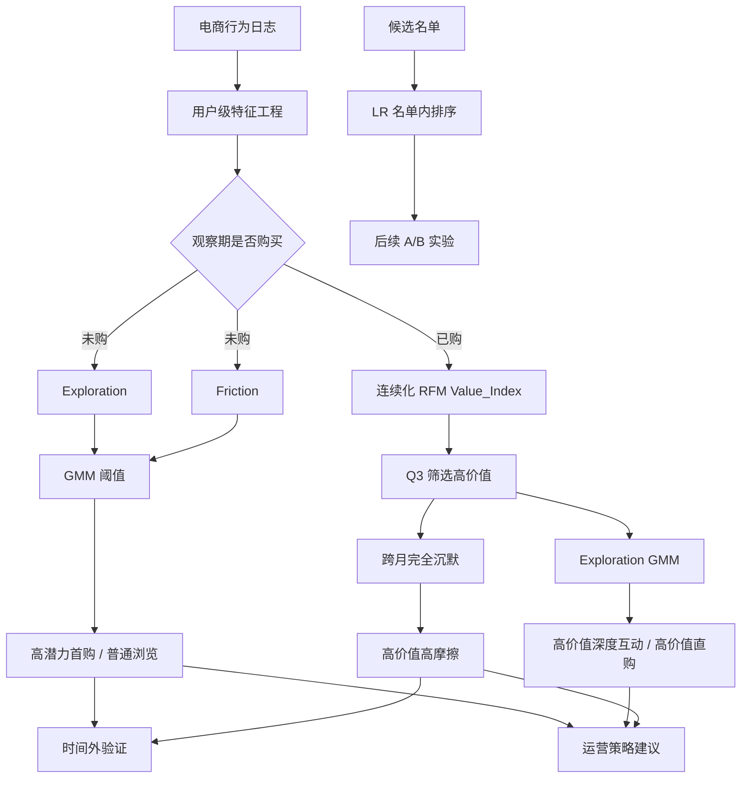

# 电商用户行为分层与差异化运营分析

> **项目定位**：电商用户行为分层与差异化运营分析
>
> **项目类型**：数据分析 / 用户运营 / 行为建模
>
> **分析目标**：从用户行为日志中识别不同用户状态，建立可解释的用户分层体系，并通过未来月份数据验证标签的区分能力，最终为差异化运营、名单筛选和后续 A/B 实验提供依据。

---

## 一、项目背景与分析框架

### 1.1 业务背景

在电商场景中，不同用户处于不同的购买阶段：未购买用户更关注首购转化，已购用户更关注复购与长期价值，而曾经具有较高消费价值、随后完全沉默的用户则更值得关注流失风险。

因此，项目希望解决的并不是简单的“给用户打标签”，而是三个连续的问题：

> **谁值得重点关注？为什么值得关注？这种标签能否预测未来行为？**

传统 RFM 直接应用于全体用户时存在明显局限：大量用户从未购买，导致 `Frequency = 0`、`Monetary = 0`，不同未购用户容易被压缩到相似的低价值区域。例如，一个完全没有购物意图的用户，与一个持续浏览并反复加购但尚未购买的用户，在传统 RFM 中可能都表现为 `F=0、M=0`，但二者对应的运营策略显然不同。

因此，本项目不采用“全体用户统一 RFM 聚类”，而是以**是否购买**作为第一层业务边界，再针对不同购买阶段设计特征和分层规则。

### 1.2 整体分析思路



项目最终形成：

> **行为数据 → 特征工程 → 用户分流 → 可解释分层 → 时间外验证 → 运营候选名单 → 名单内优先级 → A/B 实验**

---

## 二、数据处理与特征工程

### 2.1 数据来源与分析口径

数据来自 Kaggle 数据集 **e-Commerce Behavior Data from Multi Category Store**，包含用户的 `view`、`cart`、`purchase` 等行为事件。

项目按 `user_id` 哈希抽样 5%，构建约 **78 万用户、2060 万条事件**的 7 个月用户面板，文件为 `data/panel_7months.parquet`。

| 时间              | 主要用途                     |    事件数 |  用户数 |
| ----------------- | ---------------------------- | --------: | ------: |
| 2019-10           | 特征构建、阈值拟合、用户分层 | 2,117,423 | 151,447 |
| 2019-11           | 10→11 时间外验证             | 3,391,302 |       — |
| 2019-10 ~ 2020-04 | 滚动验证、队列迁移           | 约 7 个月 |       — |

所有验证均使用未来月份结果，不使用验证月购买结果构建当期标签，以降低未来信息泄露风险。

### 2.2 用户级特征

分析粒度统一为“用户”，核心特征包括：

| 特征                 | 定义                                                     | 业务含义     |
| -------------------- | -------------------------------------------------------- | ------------ |
| `Recency_Days`       | 观察期末距最近一次购买的天数；未购买用户使用观察期兜底值 | 购买新近度   |
| `Purchase_Frequency` | 观察期购买事件数                                         | 购买频次     |
| `Total_Spending`     | 观察期购买金额之和                                       | 消费贡献     |
| `Pages_Viewed`       | `view` 事件数                                            | 浏览深度     |
| `Estimated_Time`     | 会话内有效活跃时长总和                                   | 行为投入程度 |
| `Session_Count`      | 不同 `user_session` 数                                   | 访问频率     |
| `Cart_Products`      | 加购涉及的去重商品数                                     | 购物意图     |
| `Purchased_Products` | 购买涉及的去重商品数                                     | 实际购买范围 |

### 2.3 有效停留时长与长尾处理

为避免把两个独立访问之间的空档错误计入停留时间，项目先按 `user_id + user_session + event_time` 排序，仅累计**同一用户、同一会话内相邻事件时间差不超过 30 分钟**的时间间隔。

对于浏览、停留时长、消费额等明显长尾变量，后续使用 `log1p` 进行压缩；需要组合的指标再进行 Z-score 标准化，以减少极端值和量纲差异的影响。

---

## 三、用户分层：为什么这样设计，以及具体怎么做？

### 3.1 未购用户：识别高潜力首购人群

未购用户无法通过传统 RFM 区分购买价值，因此项目重点关注两个行为维度：

#### Exploration：探索度

由以下三个行为构成：

- 浏览页数 `Pages_Viewed`
- 有效停留时长 `Estimated_Time`
- 会话数 `Session_Count`

三个指标分别进行 `log1p` 变换和 Z-score 标准化，再等权组合：

$$
Exploration = \frac{Z(log1p(Pages\_Viewed)) + Z(log1p(Estimated\_Time)) + Z(log1p(Session\_Count))}{3}
$$

这个指标回答的是：**用户是否持续投入时间和行为去探索商品。**

#### Friction：购物意图未兑现程度

项目定义：

$$
Friction = max(Cart\_Products - Purchased\_Products, 0)
$$

并使用 `log1p(Friction)` 参与阈值判断。

这里的 Friction 表示的是**“加购行为没有转化为购买”**，并不把它解释为支付失败或真实因果意义上的购买障碍。

#### 分层规则

只在观察期未购买用户内部，对 `Exploration` 和 `log1p(Friction)` 分别拟合两成分 GMM，并以两个高斯成分后验概率相等的位置作为阈值。

同时满足：

```text
Exploration ≥ 阈值
AND
log1p(Friction) ≥ 阈值
```

的用户定义为：

> **高潜力首购用户**

其余未购用户定义为：

> **普通浏览用户**

2019 年 10 月的拟合结果为：

| 指标            |   阈值 |
| --------------- | -----: |
| Exploration     | -0.066 |
| log1p(Friction) |  0.006 |

由于约 **92% 的未购用户没有加购行为**，Friction 呈明显零膨胀，因此当前样本中的阈值接近 0，业务上基本体现为：

> **有加购未买 + 较高探索度 → 更高首购潜力**

### 3.2 已购用户：识别高价值用户与不同购买状态

对于已购用户，项目仍保留 RFM 的核心思想，但将三个维度连续化，而不是简单打分：

$$
Value\_Index = log1p(Total\_Spending) + log1p(Purchase\_Frequency) - log1p(Recency\_Days)
$$

该指标只在**已购用户内部**计算。

2019 年 10 月以 `Value_Index` 的 **75% 分位数（Q3）**划分高价值用户；当前阈值为：

```text
Value_Index ≥ 5.211
```

再根据 Exploration 继续区分：

| 标签           | 规则                         | 行为状态           |
| -------------- | ---------------------------- | ------------------ |
| 高价值深度互动 | 高价值 + Exploration ≥ 1.318 | 高价值且互动较深   |
| 高价值直购     | 高价值 + Exploration < 1.318 | 高价值但行为更直接 |
| 常规已购       | 未达到高价值阈值             | 一般购买用户       |

### 3.3 高价值高摩擦：通过跨月沉默识别风险

已购用户的风险标签不直接复用未购用户的 Friction，而是观察其后续活跃状态：

> **基期高价值买家，在下一观察月完全没有任何行为。**

也就是该月同时没有：

- `view`
- `cart`
- `purchase`

这批用户被标记为：

> **高价值高摩擦用户（跨月沉默）**

这个标签应理解为**流失风险预警**，而不是“已经流失”的确定结论。

---

## 四、分层结果与时间外验证

### 4.1 2019 年 10 月用户分层结果

经过跨月沉默标记后，10 月用户结构如下：

| 用户类型                     |  用户数 |   占比 | 平均消费 | 平均购买频次 | 平均探索度 | 平均摩擦力 |
| ---------------------------- | ------: | -----: | -------: | -----------: | ---------: | ---------: |
| 普通浏览用户                 | 128,519 | 84.86% |     0.00 |         0.00 |      -0.18 |       0.01 |
| 常规已购用户                 |  13,139 |  8.68% |   248.37 |         1.33 |       0.87 |       0.13 |
| 高潜力首购用户               |   5,408 |  3.57% |     0.00 |         0.00 |       1.03 |       1.23 |
| 高价值深度互动用户           |   1,534 |  1.01% | 2,675.09 |         7.10 |       2.07 |       0.26 |
| 高价值直购用户               |   1,463 |  0.97% | 1,299.98 |         2.62 |       0.65 |       0.09 |
| 高价值高摩擦用户（跨月沉默） |   1,384 |  0.91% | 1,696.85 |         4.04 |       1.00 |       0.16 |

> 10 月在 `silent_buyer` 标记前，高价值直购用户为 2,363 人、高价值深度互动用户为 2,018 人；其中分别有 900 人和 484 人在 11 月完全沉默，因此转入高价值高摩擦标签。

### 4.2 时间外验证：为什么不能只看建模月？

如果只在 10 月观察各类用户之间的行为差异，最多只能得到“标签与历史行为相关”的结论，无法判断标签能否对未来行为提供信息。

因此项目进一步采用：

> **基期月 t 建模 / 分层 → 未来月验证**

并用滚动月份重复检验。

需要明确区分三种分析口径：

- **10→11 基准分析**：使用 10 月数据拟合阈值，在 11 月验证。
- **滚动时间外验证**：每一轮以当轮基期月独立拟合阈值，再用下一月份验证。
- **队列迁移分析**：固定 2019 年 10 月阈值和标准化参数，追踪同一批用户后续月份标签变化。

### 4.3 实验一：高潜力首购标签是否能识别未来购买倾向？

以 2019-10 → 2019-11 为例：

| 用户组         |  样本量 | 11月购买人数 | 购买率 | 95% CI           |
| -------------- | ------: | -----------: | -----: | ---------------- |
| 高潜力首购用户 |   5,408 |          719 | 13.30% | [12.42%, 14.23%] |
| 普通浏览用户   | 128,519 |        6,959 |  5.41% | [5.29%, 5.54%]   |

购买率相差 **7.88 个百分点**，卡方检验得到：

```text
p = 2.2 × 10^-131
```

进一步进行滚动时间外验证后，实验一共得到 **6/6 个月组显著**，购买率差始终为正，约为：

```text
+4.5pp ~ +9.3pp
```

这说明“高探索 + 加购未买”的组合能够从大量未购用户中识别出更高首购倾向的人群。

### 4.4 实验二：跨月完全沉默是否意味着后续购买风险？

为了避免把“沉默月”和“验证月”混为同一阶段，采用 3 个月窗口：

```text
基期 t：高价值买家
    ↓
观察月 t+1：完全沉默
    ↓
验证月 t+2：观察购买行为
```

并与同期保持活跃的高价值用户进行比较。

滚动验证得到：

| 指标                   | 结果                  |
| ---------------------- | --------------------- |
| 月组数                 | 5 组                  |
| 沉默组验证月购买率     | 5.9% ~ 9.6%           |
| 活跃高价值对照组购买率 | 25.8% ~ 41.4%         |
| 购买率差               | -19.9pp ~ -31.8pp     |
| 显著性                 | 5/5 组显著，p < 1e-68 |

因此，“高价值 + 跨月完全沉默”可以作为一个**后续购买风险预警信号**。

### 4.5 用户标签稳定性：标签应该固定还是动态刷新？

项目进一步固定 2019 年 10 月为基期，冻结该月阈值与 Exploration 标准化参数，对同一批用户逐月追踪。

| 10月基期标签   | 11月保持 | 2020-01保持 | 2020-04保持 |
| -------------- | -------: | ----------: | ----------: |
| 普通浏览       |    32.3% |       24.6% |       17.1% |
| 高潜力首购     |    16.7% |        7.6% |        5.1% |
| 常规已购       |    16.2% |        8.5% |        6.1% |
| 高价值直购     |    10.9% |        5.4% |        1.8% |
| 高价值深度互动 |    18.8% |        7.8% |        2.3% |

核心结论是：

> **这些标签更适合作为“月度行为快照”，而不是长期不变的用户属性。**

用户购买存在明显间歇性，因此运营中更合理的做法是按月刷新行为、更新标签和更新名单。

---

## 五、从用户分层到运营：如何把分析结果用起来？

### 5.1 用户状态与运营策略建议

本项目目前**没有直接执行营销活动**，以下均属于基于行为特征提出的运营建议，真实增量仍需后续 A/B 实验验证。

| 用户类型       | 行为特征              | 用户状态       | 运营策略建议                                           | 主要评估指标                   |
| -------------- | --------------------- | -------------- | ------------------------------------------------------ | ------------------------------ |
| 高潜力首购     | 高探索 + 加购未买     | 首购意向较高   | 购物车提醒、价格提醒、低门槛首购券、品类个性化触达     | 首购率、购物车挽回率、首购成本 |
| 高价值高摩擦   | 高价值 + 跨月完全沉默 | 流失风险预警   | 定向召回、个性化推荐、优惠券；关注历史购买品类供给变化 | 次月购买率、召回率、客单价     |
| 高价值深度互动 | 高价值 + 高探索       | 高价值且高互动 | 新品内测、会员权益、跨品类推荐                         | 复购率、交叉购买率、会员转化率 |
| 高价值直购     | 高价值 + 低探索       | 购买路径直接   | 一键复购、补货提醒、简化支付流程                       | 复购周期、复购率、退订率       |
| 常规已购       | 已购买但价值一般      | 常规复购       | 周期性补货提醒、复购券、品类上新                       | 复购率、唤醒率、ROI            |
| 普通浏览       | 未购 + 低意向         | 购买意愿较弱   | 内容种草、关注/心愿单引导，减少强促销                  | 浏览→加购转化、升级高潜力比例  |

完整业务链路为：

> **用户类型 → 行为特征 → 用户状态 → 对应运营策略建议 → A/B 实验验证**

### 5.2 圈人之后，如何进一步做优先级排序？

当某类用户已经被规则圈定后，还需要进一步回答：

> **同一个运营人群中，谁应该优先触达？**

当前版本通过独立的 `LR_predict_rank` 完成这一步。它不负责重新定义用户标签，而只负责在已有目标名单内部预测未来购买概率并排序。

#### 模型输入

使用以下 7 个原始聚合特征：

```text
消费金额、购买频次、最近购买天数、
浏览页数、有效停留时长、会话数、加购去重商品数
```

所有特征统一进行 `log1p` 变换后进入标准化 + Logistic Regression。

#### 数据时序

模型训练严格使用预测月份之前的数据，例如使用更早月份的“行为月 → 结果月”构造训练样本，再对目标月份的人群进行预测，以避免未来信息泄露。

#### 为什么要把“圈人”和“排序”拆开？

| 模块        | 解决的问题             | 核心要求 |
| ----------- | ---------------------- | -------- |
| 规则分层    | 谁值得进入运营池？     | 可解释   |
| LR 概率排序 | 运营池里先触达谁？     | 优先级   |
| A/B 实验    | 策略是否真的带来增量？ | 因果验证 |

例如当前版本可以先获得：

```text
11月高潜力首购候选名单：17,612 人
            ↓
     LR 名单内排序
            ↓
Top 50%：8,806 人
```

`50%` 为配置项 `POOL_TOP_RATIO`，不是模型固定参数。

需要特别说明：当前报告不再使用旧版本 LR Top-k 表中的历史数字作为当前版本结论；当前版本的 LR 模块作为独立的名单排序工具存在。

### 5.3 后续 A/B 实验：从“预测有效”走向“策略有效”

时间外验证只能说明某种标签与未来购买存在稳定关联，不能证明运营动作本身造成了增量。

例如观察到：

> 高潜力首购用户次月购买率高于普通浏览用户

并不能直接推出：

> 给他们发优惠券后，一定会比不发更有效。

因此后续应针对不同候选人群随机划分实验组和对照组，再比较真实增量：

```text
候选人群
   ↓
随机实验组 / 对照组
   ↓
实验组执行对应运营策略
   ↓
统一观察窗口与指标口径
   ↓
比较差异
   ↓
评估增量与 ROI
```

例如：

- 高潜力首购：首购率、购物车挽回率、首购成本、7/30 日复购率；
- 高价值高摩擦：次月购买率、召回率、客单价、召回 ROI。

因此，本项目目前的结论属于：

> **观察性 + 时间外预测验证**

而最终判断运营策略是否有效，需要进一步进行随机对照实验。

---

## 六、项目总结与复现

### 6.1 主要业务发现

项目形成了六类用户标签：

```text
普通浏览
高潜力首购
常规已购
高价值直购
高价值深度互动
高价值高摩擦（跨月沉默）
```

核心发现包括：

1. **高潜力首购用户**共 5,408 人，次月购买率 13.30%，较普通浏览用户高 7.88pp；滚动验证中 6/6 个月组均显著。
2. **高价值高摩擦用户**共 1,384 人；在滚动验证中，沉默组验证月购买率比活跃高价值对照低 19.9~31.8pp，5/5 个月组显著。
3. 标签保持率随时间下降，说明用户状态具有明显动态性，运营名单应持续更新，而不宜一次打标后长期使用。
4. 当前分析能够验证标签的未来区分能力，但还不能直接证明某种营销策略带来的因果增量。

### 6.2 项目体现的数据分析能力

这个项目重点体现的是完整的问题解决链路，而不是单纯展示模型数量：

- **业务问题拆解**：识别传统 RFM 对大量未购用户区分不足的问题；
- **指标设计**：构造与用户购买阶段匹配的 Exploration、Friction、Value_Index；
- **统计验证**：使用未来月份数据做时间外验证，并结合卡方检验与 Wilson 95% CI 判断差异；
- **模型应用**：用 GMM 进行数据驱动阈值识别，用 Logistic Regression 做名单内优先级排序；
- **业务落地**：将标签转化为运营候选池与策略建议，并为后续 A/B 实验提供实验人群基础。

最终形成一套完整框架：

> **业务问题 → 指标设计 → 用户分层 → 预测验证 → 运营建议 → 名单排序 → A/B 实验**

### 6.3 项目文件与复现方式

```text
ecommerce-user-behavior-segmentation/
├── src/
│   ├── analysis.py                # 核心分析函数：特征工程、分层、验证、LR 排序
│   ├── config.py                  # 月份、阈值、路径等配置
│   ├── run_rolling.py             # 滚动时间外验证入口
│   ├── run_cohort.py              # 队列迁移分析入口
│   └── sample_user_cohort.py      # 按 user_id 哈希抽样生成 7 个月面板
├── main.ipynb                     # Notebook：完整分析与可视化
├── results/
│   ├── rolling_validation_results.csv # 滚动验证结果
│   ├── cohort_frozen_labels.csv       # 冻结阈值后的队列迁移结果
│   └── tracked_users_list_Nov.csv     # 候选触达名单
├── tests/
│   └── test_analysis.py           # 核心逻辑单元测试（合成数据）
├── docs/
│   └── 数据分析报告.md            # 本报告
├── data/                          # 原始数据与缓存（体积大，不入库）
└── README.md
```

推荐复现顺序：

```text
1. 准备 data/panel_7months.parquet（可由 python -m src.sample_user_cohort 从按月 csv.gz 重建）
2. 运行 main.ipynb 查看完整分析与可视化
3. 运行 python -m src.run_rolling 生成滚动验证结果（约 15-25 分钟）
4. 运行 python -m src.run_cohort 生成队列迁移结果（约 10-20 分钟）
5. 根据目标名单调用 LR_predict_rank 进行名单内排序
```

### 6.4 核心指标速查

| 指标           | 公式 / 规则                                                  | 适用人群         |
| -------------- | ------------------------------------------------------------ | ---------------- |
| `Exploration`  | `log1p` + Z-score 后的浏览页数、有效停留时长、会话数等权均值 | 全体用户         |
| `Friction`     | `max(Cart_Products - Purchased_Products, 0)`                 | 主要用于未购用户 |
| `Value_Index`  | `log1p(消费金额) + log1p(购买频次) - log1p(最近购买天数)`    | 已购用户         |
| 高潜力首购     | 未购 + Exploration 超阈值 + log1p(Friction) 超阈值           | 未购用户         |
| 高价值         | 已购 + Value_Index ≥ Q3                                      | 已购用户         |
| 高价值深度互动 | 高价值 + Exploration ≥ GMM 阈值                              | 高价值用户       |
| 高价值直购     | 高价值 + Exploration < GMM 阈值                              | 高价值用户       |
| 高价值高摩擦   | 基期高价值 + 观察月完全无行为                                | 高价值用户       |
| `TopK_Flag`    | 候选名单内按 LR 概率排序后取前 `POOL_TOP_RATIO`              | 运营候选池       |
