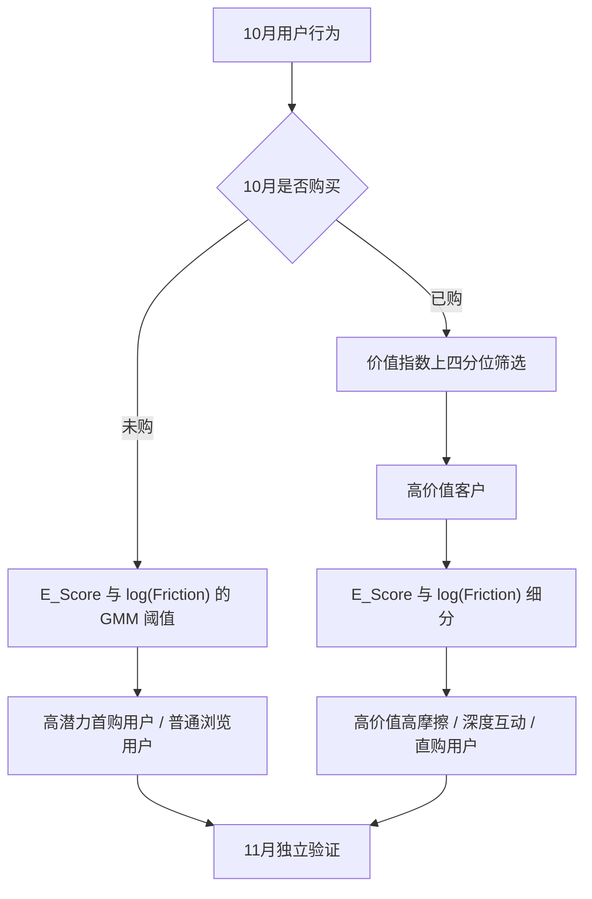

# 用户价值与购买潜力分层分析报告 · UserValue&Potential

## 一、执行摘要

本项目以电商用户行为日志为基础，建立“已购价值识别 + 未购首购潜力识别”的用户分层体系。相较于直接将全体用户纳入传统 RFM 聚类的方式，优化方案先区分已购与未购用户，再分别使用可解释的价值、探索和决策摩擦指标进行分层，避免大量零购买用户导致 RFM 聚类退化。

在独立的 11 月数据上进行时间外验证后，得到两项核心结论：

| 业务问题 | 结论 | 统计证据 |
|---|---:|---|
| 有加购未买行为、探索度高的未购用户是否更可能在下月首购？ | 是，购买率 **17.44%**，较普通浏览用户高 **10.74 个百分点** | χ² 检验 p = 8.75×10⁻²⁰ |
| 高价值且加购未买较多的用户是否存在后续购买风险？ | 未检出显著差异（购买率 41.94% vs 49.31%），加购未买在 VIP 中更接近活跃意向而非流失风险 | χ² 检验 p = 0.342 |

因此，可将 **539 名高潜力首购用户**纳入首购激励候选池（优先做购物车挽回），并将 **62 名高价值高摩擦用户**列入体验排障观察名单——但加购未买口径下其与低摩擦 VIP 的次月购买差异未达统计显著，需更大样本或更长观察窗复核。以上结果属于观察性、时间外预测验证；具体营销增量仍需以随机 A/B 实验确认。

---

## 二、项目背景与目标

在存量电商环境中，单纯依赖消费金额和购买频率的 RFM 模型，容易将尚未下单、但浏览意愿强且决策受阻的用户统一归为低价值；同时，传统 RFM 无法直接刻画用户购买前的行为路径。

本项目的目标是：

1. 利用会话级浏览行为补充 RFM 的后验消费视角；
2. 从未购用户中识别更可能完成首购的候选人群；
3. 从高价值客户中识别加购未买较多、可能存在购买阻力的观察人群；
4. 使用未来一个月的独立数据验证分层对后续购买的区分能力，并输出可用于运营实验的名单。

---

## 三、数据来源与分析设计

### 1. 数据来源

数据来自 Kaggle 的 [e-Commerce Behavior Data from Multi Category Store](https://www.kaggle.com/datasets/mkechinov/ecommerce-behavior-data-from-multi-category-store)，包含浏览（`view`）、加购（`cart`）和购买（`purchase`）等事件。

本项目样本覆盖 2019 年 10 月至 11 月：

| 时间窗口 | 用途 | 事件数 |
|---|---|---:|
| 10 月 | 特征构建、阈值拟合与用户分层 | 308,850 |
| 11 月 | 独立时间外验证 | 259,377 |

10 月共覆盖 10,000 名用户。其中 10 月事件含浏览 296,323 条、加购 6,350 条、购买 6,177 条（11 月为浏览 244,994 条、加购 10,833 条、购买 3,550 条）。模型的所有阈值只使用 10 月数据拟合，11 月不参与分层建模，避免未来信息泄露。

### 2. 分析口径

分析粒度为用户。有效停留时长使用 `user_id + user_session` 划分会话：会话内相邻事件间隔在 30 分钟以内时计入有效活跃时长，避免将跨会话的空档错误累计为浏览时长。

| 指标 | 定义 | 用途 |
|---|---|---|
| `Recency_Days` | 观察期末距最近一次购买的天数 | 衡量购买新近度 |
| `Purchase_Frequency` | 观察期购买事件数 | 衡量购买频次 |
| `Total_Spending` | 观察期购买金额之和 | 衡量消费贡献 |
| `Cart_Products` | 观察期加购事件的去重商品数 | 识别购物车意图，支撑 Friction 计算 |
| `E_Score` | 浏览页数、有效停留时长、会话数经 log1p 与 Z-score 后的等权均值 | 衡量主动探索程度（定义不变） |
| `Friction` | 加购但未购买的去重商品数：max(`Cart_Products` − 去重购买商品数, 0)，取 log1p | 度量“加购了却没买”的决策摩擦 / 购买意图受阻，与浏览页数无关 |

`Friction` 直接反映“购物车意图未兑现”的行为成本，但不能据此指认支付失败、价格、库存或配送等具体原因；具体原因仍需结合漏斗与商品维度数据排查。

---

## 四、分层方法

### 1. 为什么不直接使用全量 RFM K-Means

10 月样本中存在大量零购买用户。若把全体用户直接进行 RFM 聚类，零购买用户会在频次和金额上高度重叠，导致多个簇中心拥有相同方向，之后再将其强行命名为传统 RFM 八象限，标签不再由数据自然支持。

优化方案改为两阶段分层：



### 2. 阈值与规则

- 未购用户：对 `E_Score` 和 `log1p(Friction)` 分别拟合双成分 GMM，以两成分后验概率相等的位置作为阈值；同时高于两个阈值者定义为高潜力首购用户。由于 92% 的未购用户没有加购行为，`log1p(Friction)` 呈零膨胀分布，GMM 交点退化到 ≈0，即“有加购未买行为即视为高摩擦”。
- 已购用户：价值指数 = `log1p(消费金额) + log1p(购买频次) - log1p(最近购买天数)`；位于已购用户上四分位者定义为高价值客户。
- 高价值客户：再按 GMM 阈值区分高摩擦（加购未买）、深度互动与直购用户。

实际拟合阈值如下：

| 阈值 | 数值 |
|---|---:|
| 高价值指数阈值 | 5.339 |
| 未购用户 E_Score 阈值 | -0.257 |
| 未购用户 log(Friction) 阈值 | 0.005（≈0，即“有加购即高摩擦”） |
| 高价值用户 E_Score 阈值 | 1.047 |
| 高价值用户 log(Friction) 阈值 | 0.005（≈0，即“有加购即高摩擦”） |

---

## 五、用户分层结果

| 用户人群 | 用户数 | 占比 | 平均消费 | 平均购买频次 | 平均探索度 | 平均摩擦力 |
|---|---:|---:|---:|---:|---:|---:|
| 普通浏览用户 | 7,479 | 74.79% | 0.00 | 0.00 | -0.27 | 0.01 |
| 常规已购用户 | 1,486 | 14.86% | 280.92 | 1.46 | 0.68 | 0.16 |
| 高潜力首购用户 | 539 | 5.39% | 0.00 | 0.00 | 0.83 | 1.35 |
| 高价值直购用户 | 220 | 2.20% | 2,018.19 | 4.51 | 0.51 | 0.00 |
| 高价值深度互动用户 | 214 | 2.14% | 4,202.05 | 11.75 | 1.60 | 0.00 |
| 高价值高摩擦用户 | 62 | 0.62% | 4,550.68 | 7.97 | 1.35 | 1.95 |

### 关键洞察

1. **加购未买是比“浏览多”更精准的首购信号。** 改用“加购未买”定义摩擦后，高潜力首购用户从 3,913 人收缩到 539 人（占未购用户 6.7%），但 11 月购买率达 17.44%，是对照组的 2.6 倍；且加购商品数与浏览页数仅弱相关（r≈0.28），是独立的意图维度。
2. **高价值用户的“摩擦”叙事需要重构。** 加购未买口径下，高价值高摩擦用户仅 62 人，其 11 月购买率（41.94%）与低摩擦 VIP（49.31%）差异不显著（p=0.342）。加购更多反映活跃意向而非流失风险；原“浏览成本高 = 购买受阻”的预警叙事不再成立。
3. **深度互动用户价值依然最高。** 该群体平均消费 4,202.05，购买频次 11.75，适合作为新品试用、会员运营与高价值交叉销售的优先对象。

---

## 六、时间外验证与统计检验

### 实验一：高潜力首购用户的次月购买率

比较对象为：10 月被识别为高潜力首购用户（有加购未买行为且探索度高），与同样在 10 月未购买、但未满足高潜力条件的普通浏览用户。11 月是否发生至少一次购买作为结果变量。

| 组别 | 样本量 | 11 月购买人数 | 购买率 | 95% CI |
|---|---:|---:|---:|---|
| 高潜力首购用户 | 539 | 94 | **17.44%** | [14.47%, 20.87%] |
| 普通浏览用户 | 7,479 | 501 | **6.70%** | [6.15%, 7.29%] |

高潜力首购用户的购买率较对照组高 **10.74 个百分点**，卡方检验 p = 8.75×10⁻²⁰。这表明“加购未买 + 高探索”的标签在独立时间窗口内能够显著区分后续首购倾向，且人群规模（539 人）比旧口径（3,913 人）更利于精准触达。

### 实验二：高价值高摩擦用户的购买风险

为避免“高价值人群天然表现不同”的混杂，目标组只与同为高价值、但摩擦较低的直购/深度互动 VIP 对照组比较。

| 组别 | 样本量 | 11 月购买人数 | 购买率 | 95% CI |
|---|---:|---:|---:|---|
| 高价值高摩擦用户 | 62 | 26 | **41.94%** | [30.48%, 54.33%] |
| 同价值低摩擦 VIP 对照 | 434 | 214 | **49.31%** | [44.63%, 54.00%] |

风险差为 **−7.37 个百分点**，卡方检验 p = 0.342，**未达到统计显著**。需要注意：Friction 由“浏览成本”改为“加购未买”后，该结论由显著变为不显著——这提示摩擦口径的选择直接改变业务结论。加购未买在 VIP 人群中更接近“高活跃意向”而非“流失风险”；同时目标组仅 62 人，功效不足，建议以更大样本或更长观察窗复核，并保留体验排障观察名单但不再作为高置信流失预警。

### 结果边界

上述比较验证的是分层标签与未来购买行为之间的关联和预测区分度，并非对营销动作效果的因果估计。用户尚未被随机分配到营销策略，因此不能把风险差直接称为“营销提升”或“可实现营收增量”。

---

## 七、运营策略与后续实验

| 人群 | 推荐策略 | 后续 A/B 实验主要指标 |
|---|---|---|
| 高潜力首购用户 | 对加购未买的商品定向推送购物车提醒、价格提醒与低门槛首购券，结合浏览品类个性化；避免全量大额补贴 | 首购率、购物车挽回率、首购成本、7/30 日复购率 |
| 高价值高摩擦用户 | 加购未买口径下更接近高活跃用户：优先排查高频加购商品的缺货、价格、规格与配送路径，做购物车挽回；流失预警需更大样本复核 | 次月购买率、购物车挽回率、客单价、投诉率 |
| 高价值深度互动用户 | 新品内测、会员权益、跨品类推荐 | 复购率、交叉购买率、会员转化率 |
| 高价值直购用户 | 一键复购、补货提醒与简化支付；控制打扰频率 | 复购周期、快捷支付使用率、退订率 |

建议以用户为随机化单位，将符合条件的人群分为实验组和对照组，预先定义转化口径、观察窗口、最小可检测效应和停止规则。这样才能把“预测有效”进一步升级为“策略带来真实增量”。

---

## 八、结论

优化后的分层体系将“用户是否已经购买”作为首要业务边界，并将会话级浏览行为与购物车意图结合：一方面，以“加购未买 + 高探索”识别出 539 名在次月显著更易转化的高潜力首购用户（购买率 17.44%，较对照高 10.74 个百分点）；另一方面，加购未买口径下高价值高摩擦用户的次月购买差异不再显著（p=0.342），提示“摩擦”需按人群分别解读，浏览成本与加购未买是两个不同的行为维度。

项目最终产出为一套可复现的数据处理与验证流程，以及包含 **601 名**高潜力首购/高价值高摩擦用户的候选名单（其中高潜力首购 539 人、高价值高摩擦 62 人）。该名单可直接作为下一阶段随机 A/B 营销或购物车挽回实验的抽样框。

---

## 九、复现说明

在 `project4.0` 目录运行：

```bash
pip install -r requirements.txt
python main.py
```

将重新生成：

- `validation_results.csv`：两项时间外验证的汇总结果；
- `tracked_users_list_Nov.csv`：高潜力首购与高价值高摩擦候选用户清单。

核心实现见 `main.py` 与 `shared_utils.py`。
