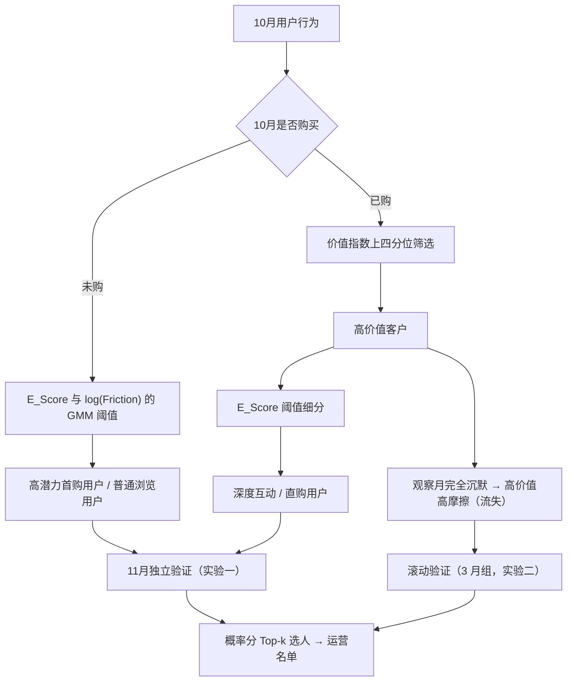

# 用户价值与购买潜力分层分析报告 · UserValue&Potential

## 一、执行摘要

本项目以电商用户行为日志为基础，建立“已购价值识别 + 未购首购潜力识别”的用户分层体系。相较于直接将全体用户纳入传统 RFM 聚类的方式，优化方案先区分已购与未购用户，再分别使用可解释的价值、探索和决策摩擦指标进行分层，避免大量零购买用户导致 RFM 聚类退化。

在 7 个月用户面板（5% 抽样约 78 万用户）上，以 10 月数据建模、独立 11 月数据验证，得到两项核心结论：

| 业务问题 | 结论 | 统计证据 |
|---|---:|---|
| 有加购未买行为、探索度高的未购用户是否更可能在下月首购？ | 是，购买率 **13.30%**，较普通浏览用户高 **7.88 个百分点** | χ² 检验（卡方检验，比较两组率的差异是否显著）p = 2.2×10⁻¹³¹ |
| 基期高价值买家在观察月完全沉默（无任何行为）是否预示流失？ | 是，沉默高价值用户的验证月购买率显著更低 | 5/5 个月组极显著，购买率差 **−19.9~−31.8pp**（p<1e-68，滚动验证） |

因此，可将 **5,408 名高潜力首购用户**纳入首购激励候选池（优先做购物车挽回），并将 **1,384 名跨月完全沉默的高价值用户**列入流失预警与召回名单。以上结果属于观察性、时间外预测验证；具体营销增量仍需以随机 A/B 实验确认。

---

## 二、项目背景与目标

在存量电商环境中，单纯依赖消费金额和购买频率的 RFM 模型，容易将尚未下单、但浏览意愿强且决策受阻的用户统一归为低价值；同时，传统 RFM 无法直接刻画用户购买前的行为路径。

本项目的目标是：

1. 利用会话级浏览行为补充 RFM 的后验消费视角；
2. 从未购用户中识别更可能完成首购的候选人群；
3. 从高价值客户中识别在观察月完全沉默、可能存在流失风险的人群；
4. 使用未来月份的独立数据验证分层对后续购买的区分能力，并输出可用于运营实验的名单。

---

## 三、数据来源与分析设计

### 1. 数据来源

数据来自 Kaggle 的 [e-Commerce Behavior Data from Multi Category Store](https://www.kaggle.com/datasets/mkechinov/ecommerce-behavior-data-from-multi-category-store)，包含浏览（`view`）、加购（`cart`）和购买（`purchase`）等事件。

本项目统一使用 **7 个月用户面板**（按 user_id 哈希抽样 5%，约 78 万用户 / 2060 万条事件，`data/panel_7months.parquet`）：

| 时间窗口 | 用途 | 事件数 | 用户数 |
|---|---:|---:|---:|
| 2019-10 | 特征构建、阈值拟合与用户分层 | 2,117,423 | 151,447 |
| 2019-11 | 独立时间外验证（实验一） | 3,391,302 | — |

模型的所有阈值只使用 10 月数据拟合，11 月不参与分层建模，避免未来信息泄露。

### 2. 分析口径

分析粒度为用户。有效停留时长使用 `user_id + user_session` 划分会话：会话内相邻事件间隔在 30 分钟以内时计入有效活跃时长，避免将跨会话的空档错误累计为浏览时长。

| 指标 | 定义 | 用途 |
|---|---|---|
| `Recency_Days` | 观察期末距最近一次购买的天数 | 衡量购买新近度 |
| `Purchase_Frequency` | 观察期购买事件数 | 衡量购买频次 |
| `Total_Spending` | 观察期购买金额之和 | 衡量消费贡献 |
| `Cart_Products` | 观察期加购事件的去重商品数 | 识别购物车意图，支撑 Friction 计算 |
| `E_Score` | 浏览页数、有效停留时长、会话数经 log1p 与 Z-score 后的等权均值 | 衡量主动探索程度 |
| `Friction` | 加购但未购买的去重商品数：max(`Cart_Products` − 去重购买商品数, 0)，取 log1p | 度量“加购了却没买”的决策摩擦 / 购买意图受阻，与浏览页数无关 |

`Friction` 直接反映“购物车意图未兑现”的行为成本，但不能据此指认支付失败、价格、库存或配送等具体原因；具体原因仍需结合漏斗与商品维度数据排查。

**未购用户的判断标准（重要说明）**：本项目说的“未购用户”，指**建模当月（10 月）没有任何购买记录**的用户（看的是当月行为日志），而不是“历史上从未购买过”的新人。换句话说，“高潜力首购用户”实际是“10 月没买、但有加购没买或浏览行为的人”，其中可能混着以前买过、10 月没买的人（老客回流），不能直接当成“新客名单”用；实验一的“首购率”准确含义是“10 月未购 → 11 月发生购买的比例”。如果业务要的是严格意义的“从没买过的人”（纯拉新），需要在这 7 个月面板上再加一个“历史是否买过”的判断来区分——是否严格区分，取决于运营目标是拉新还是唤醒老客。

**关于 log1p 与偏度的说明（为什么不做更强的变换）**：原始消费 / 频次偏度高达 50~60（少数大额用户主导），`log1p` 把量级压缩后，页数 / 时长 / 会话已接近对称（偏度 0.8 / −0.4 / 1.5）；频次 / 消费 / 加购仍严重偏（2.7~3.9），但它们的 0 值占比高达 88%+，说明偏度主要来自“未购买人群的 0 堆积”——这是业务信息本身（大多数用户没买），而非尺度问题，任何单调变换都无法消除。本项目下游（GMM 找切分点、LR 排序、分位数切分）均不假设正态性，故不做 Box-Cox / Yeo-Johnson / 分位数变换（它们会破坏 `log1p` 的可解释性，且对 0 堆积类无效）；仅当未来改用对分布敏感的模型（KNN、朴素贝叶斯、直接回归等）时才需考虑极端值截断（如 99 分位 clip）。详细解读见 `main.ipynb` EDA 章节“偏度解读”小节。

---

## 四、分层方法

### 1. 为什么不直接使用全量 RFM K-Means

10 月样本中存在大量零购买用户。若把全体用户直接进行 RFM 聚类，零购买用户会在频次和金额上高度重叠，导致多个簇中心拥有相同方向，之后再将其强行命名为传统 RFM 八象限，标签不再由数据自然支持。

优化方案改为两阶段分层：



### 2. 阈值与规则

- 未购用户：对 `E_Score` 和 `log1p(Friction)` 分别拟合双成分 GMM（高斯混合模型，假设人群由两个正态分布混合），以两成分后验概率相等的位置作为阈值；同时高于两个阈值者定义为高潜力首购用户。由于 92% 的未购用户没有加购行为，`log1p(Friction)` 呈零膨胀分布，GMM 交点退化到 ≈0，即“有加购未买行为即视为高摩擦”。
- 已购用户：价值指数 = `log1p(消费金额) + log1p(购买频次) - log1p(最近购买天数)`；位于已购用户上四分位（价值从高到低排序的前 25% 分界）者定义为高价值客户。
- 高价值客户：再按 `E_Score` 的 GMM 阈值细分为深度互动 / 直购用户。
- 高价值高摩擦（流失）：由 `flag_buyer_silence` 标记——基期高价值买家在观察月完全无任何事件（view / cart / purchase 都没有）。

实际拟合阈值如下（10 月，面板口径）：

| 阈值 | 数值 |
|---|---:|
| 高价值指数阈值 | 5.211 |
| 未购用户 E_Score 阈值 | −0.066 |
| 未购用户 log(Friction) 阈值 | 0.006（≈0，即“有加购即高摩擦”） |
| 高价值用户 E_Score 阈值 | 1.318 |

---

## 五、用户分层结果

| 用户人群 | 用户数 | 占比 | 平均消费 | 平均购买频次 | 平均探索度 | 平均摩擦力 |
|---|---:|---:|---:|---:|---:|---:|
| 普通浏览用户 | 128,519 | 84.86% | 0.00 | 0.00 | −0.18 | 0.01 |
| 常规已购用户 | 13,139 | 8.68% | 248.37 | 1.33 | 0.87 | 0.13 |
| 高潜力首购用户 | 5,408 | 3.57% | 0.00 | 0.00 | 1.03 | 1.23 |
| 高价值深度互动用户 | 1,534 | 1.01% | 2,675.09 | 7.10 | 2.07 | 0.26 |
| 高价值直购用户 | 1,463 | 0.97% | 1,299.98 | 2.62 | 0.65 | 0.09 |
| 高价值高摩擦用户（跨月沉默） | 1,384 | 0.91% | 1,696.85 | 4.04 | 1.00 | 0.16 |

### 关键洞察

1. **加购未买是比“浏览多”更精准的首购信号。** “加购未买 + 高探索”识别出的高潜力首购用户 5,408 人（占未购用户 4.0%），但 11 月购买率达 13.30%，是普通浏览用户的 2.5 倍；且加购商品数与浏览页数仅弱相关，是独立的意图维度。
2. **高价值高摩擦 = 跨月完全沉默。** 该群体 1,384 人，平均消费 1,696.85、购买频次 4.04——曾是高价值买家但观察月无任何行为，是流失预警与召回的核心对象。
3. **深度互动用户价值依然最高。** 该群体平均消费 2,675.09，购买频次 7.10，适合作为新品试用、会员运营与高价值交叉销售的优先对象。

---

## 六、时间外验证与统计检验

### 实验一：高潜力首购用户的次月购买率（滚动时间外验证 ①a，2019-10→11 组）

正式验证采用滚动时间外验证（见上节结构说明），本节展示其 2019-10 基期 → 2019-11 验证组：比较 10 月被识别为高潜力首购用户（有加购未买行为且探索度高），与同样在 10 月未购买、但未满足高潜力条件的普通浏览用户。11 月是否发生至少一次购买作为结果变量。

| 组别 | 样本量 | 11 月购买人数 | 购买率 | 95% CI |
|---|---:|---:|---:|---|
| 高潜力首购用户 | 5,408 | 719 | **13.30%** | [12.42%, 14.23%] |
| 普通浏览用户 | 128,519 | 6,959 | **5.41%** | [5.29%, 5.54%] |

高潜力首购用户的购买率较对照组高 **7.88 个百分点**，卡方检验（比较两组率的差异是否显著）p = 2.2×10⁻¹³¹。这表明“加购未买 + 高探索”的标签在独立时间窗口内能够显著区分后续首购倾向；样本量（目标 5,408 / 对照 12.9 万）远大于常规小样本，结论稳健。

### 实验二：高价值高摩擦（跨月沉默）的流失验证

实验二需要 3 个月窗口（基期 t 高价值买家 → 观察月 t+1 完全沉默 → 验证月 t+2 是否购买，避免“沉默月=结果月”的循环定义），因此在 7 个月用户面板上做 **3 月组滚动验证**，与活跃高价值对照组比较：

| 指标 | 结果 |
|---|---:|
| 月组数（2019-10 → 2020-04） | 5 组，全部极显著 |
| 沉默组 vs 活跃 VIP 验证月购买率 | 5.9% ~ 9.6% vs 25.8% ~ 41.4% |
| 购买率差 | **−19.9 ~ −31.8 个百分点** |
| p 值 | < 1e-68 |

结论：“跨月完全沉默”是可靠的流失信号——基期高价值买家一旦在观察月完全无行为，其后续购买概率显著低于仍活跃的高价值对照。当前版本以沉默作为已购人群的高摩擦定义。

### 结果边界

上述比较验证的是分层标签与未来购买行为之间的关联和预测区分度，并非对营销动作效果的因果估计。用户尚未被随机分配到营销策略，因此不能把购买率差直接称为“营销提升”或“可实现营收增量”。

---

## 七、标签稳定性：10 月队列的跨月演变（队列迁移分析）

固定 2019-10 为基期，在 7 个月用户面板上逐月追踪**同一批用户**，并用**冻结的基期阈值**重算后续月标签（避免每月重新拟合的 GMM / 分位阈值漂移污染标签变化；E_Score 的 Z 标准化参数同样在基期拟合后冻结复用），回答“标签是保持还是转化”。

### 1. 标签保持率：标签稳不稳？

| 10 月标签 | 11 月保持 | 2020-01 保持 | 2020-04 保持 |
|---|---:|---:|---:|
| 普通浏览 | 32.3% | 24.6% | 17.1% |
| 高潜力首购 | 16.7% | 7.6% | 5.1% |
| 常规已购 | 16.2% | 8.5% | 6.1% |
| 高价值直购 | 10.9% | 5.4% | 1.8% |
| 高价值深度互动 | 18.8% | 7.8% | 2.3% |

### 2. 转化去向（以 11 月为例）

- **普通浏览**：56.5% 无任何活动、32.3% 保持、5.8% 变高潜力首购、5.5% 升级已购；
- **高潜力首购**：34.0% 无任何活动、36.0% 变普通浏览、16.7% 保持、10.2% 变常规已购、3.1% 升级高价值；
- **常规已购**：40.5% 无任何活动、28.5% 变普通浏览、16.2% 保持、9.2% 变高潜力首购、5.5% 升级高价值；
- **高价值直购**：38.1% 无任何活动、19.4% 变普通浏览、18.7% 降级常规已购、10.9% 保持、7.0% 升级深度互动、5.9% 变高潜力首购；
- **高价值深度互动**：24.0% 无任何活动、20.2% 变普通浏览、21.6% 降级常规已购、18.8% 保持、5.6% 变直购、9.9% 变高潜力首购。

### 关键结论

1. **标签是“月度快照”而非持久属性**：所有标签次月保持率仅 10.9%~32.3%，6 个月后大多降至 1.8%~17.1%。原因是标签以“当月是否购买 + 价值指数”定义，而用户购买天然间歇——某月不买就会落入未购或沉默桶。**运营名单需按月刷新**，不能一劳永逸。
2. **普通浏览是“稳定容器”而非“稳定客户”**：它保持率最高（32.3%）只是因为“不买就落回默认桶”，真正要运营的是其中浮现的高潜力信号（5.8% 变高潜力首购）。
3. **高价值深度互动粘性最强（购买标签中）**：无任何活动占比最低（11 月 24%）、次月购买占比最高（46.0% = 常规 21.6% + 直购 5.6% + 深度互动 18.8%）——最适合长期会员 / 新品内测运营。
4. **常规已购流失风险最高**：40.5% 次月无任何活动，6 个月后约 70%——需要及时唤醒触达。
5. **无任何活动 ≠ 永久流失**：标签基于当月行为，用户重新活跃后会回到相应标签（如高价值直购 2020-02 有 7.9% 回到常规已购）→ 沉默高价值用户值得定向召回。

**商业含义**：标签用于“当月选人 + 差异化话术”（解释层），触达名单应每月按最新行为刷新；对高价值深度互动做长期关系运营，对常规已购与高价值直购做高频复购唤醒，对沉默高价值做定向召回。

---

## 八、运营策略与后续实验

| 人群 | 推荐策略 | 后续 A/B 实验主要指标 |
|---|---|---|
| 高潜力首购用户 | 对加购未买的商品定向推送购物车提醒、价格提醒与低门槛首购券，结合浏览品类个性化；避免全量大额补贴 | 首购率、购物车挽回率、首购成本、7/30 日复购率 |
| 高价值高摩擦用户（跨月沉默） | 流失预警 + 召回：定向优惠券、个性化推荐与人工回访；优先排查曾购买品类的供给变化 | 次月购买率、召回率、客单价 |
| 高价值深度互动用户 | 新品内测、会员权益、跨品类推荐 | 复购率、交叉购买率、会员转化率 |
| 高价值直购用户 | 一键复购、补货提醒与简化支付；控制打扰频率 | 复购周期、快捷支付使用率、退订率 |

建议以用户为随机化单位，将符合条件的人群分为实验组和对照组，预先定义转化口径、观察窗口、最小可检测效应和停止规则。这样才能把“预测有效”进一步升级为“策略带来真实增量”。

---

## 九、结论

优化后的分层体系将“用户是否已经购买”作为首要业务边界，并将会话级浏览行为与购物车意图结合：一方面，以“加购未买 + 高探索”识别出 5,408 名在次月显著更易转化的高潜力首购用户（购买率 13.30%，较对照高 7.88 个百分点）；另一方面，以“跨月完全沉默”识别出 1,384 名高价值流失预警用户（滚动验证 5/5 月组显著，购买率差 −19.9~−31.8pp）。队列迁移分析进一步表明：标签是月度快照、需按月刷新，高价值深度互动粘性最强，常规已购流失风险最高，沉默高价值用户值得定向召回。

项目最终产出为一套可复现的数据处理与验证流程，以及包含 **6,792 名**候选用户的运营名单（其中高潜力首购 5,408 人、跨月沉默高价值 1,384 人）。该名单可直接作为下一阶段随机 A/B 营销或流失召回实验的抽样框。

---

## 十、复现说明

在本目录运行：

```bash
pip install -r requirements.txt
jupyter notebook main.ipynb
```

按 Notebook 顺序运行即可重新生成：

- `tracked_users_list_Nov.csv`：高潜力首购与高价值高摩擦候选用户清单（6,792 人，10 列）；
- `rolling_validation_results.csv` / `rolling_baseline_results.csv`：滚动时间外验证结果（读现成 CSV，或运行 `python run_rolling.py` 重算）；
- `cohort_frozen_labels.csv`：队列迁移分析结果（读现成 CSV，或运行 `python run_cohort.py` 重算，约 10-20 分钟）。

全部分析统一使用 7 个月面板 `data/panel_7months.parquet`（可运行 `python sample_user_cohort.py` 从按月 csv.gz 重建）。核心实现见 `analysis.py` 与 `config.py`。
